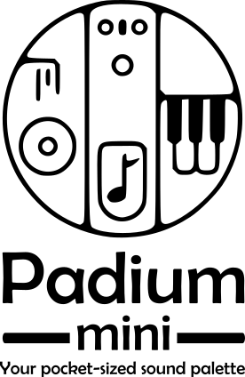

# Padium Mini

**Open Source, Open Possibilities**

Padium Mini is a compact, open-source foot controller designed to expand your sonic horizons. 
With its minimalist design and flexible capabilities, you can create a wide range of soundscapes and ambient textures.

**Key Features:**

* **Intuitive Foot Control:** Effortlessly control multiple parameters with your feet.
* **Customizable Mappings:** Tailor the pedals to your specific needs and preferences.
* **Open-Source Freedom:** Modify, share, and innovate with the community.
* **Included Schematics and Drill Instructions:** Easily build your own Padium Mini.

**Collaboration**

We encourage collaboration and community involvement. Feel free to:

* **Fork the Repository:** Create your own version of the project and make modifications.
* **Submit Pull Requests:** Contribute your code improvements to the main repository.
* **Share Your Creations:** Post your projects, modifications, and performances online.
* **Join the Community:** Connect with other Padium Mini users and developers.

**Let Your Creativity Flow**

Padium Mini empowers you to explore new sonic territories and elevate your music to new heights. 
With its compact design, open-source nature, and included schematics, you can build and customize your own unique instrument.

**Join the Padium Mini Community**

Connect with other Padium Mini users, share your creations, and get the latest updates:

**Let's create something amazing together!**
